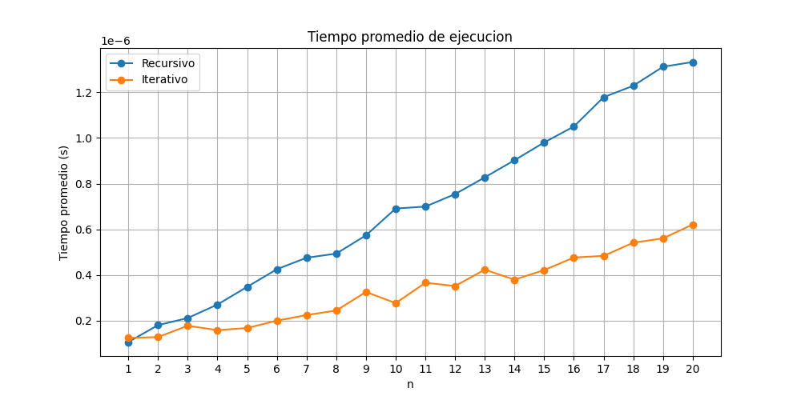
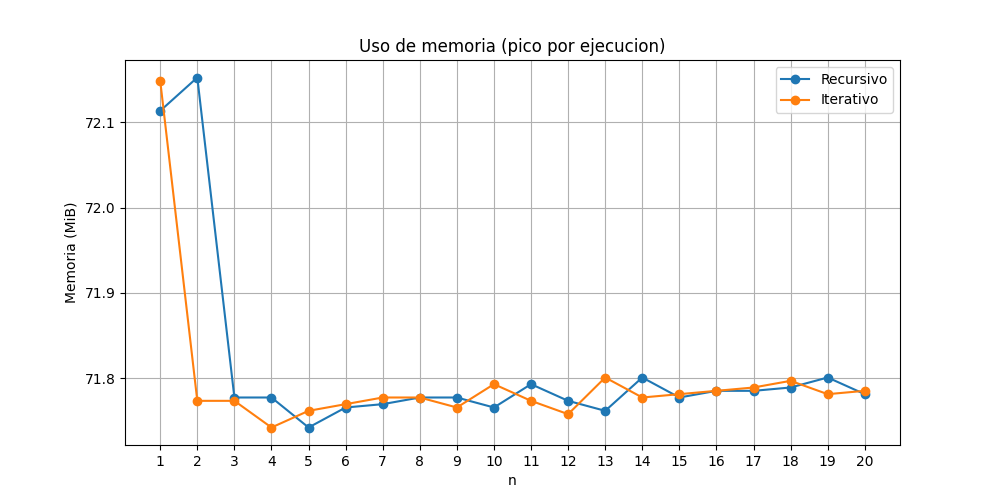

# Comparación de Eficiencia: Factorial Recursivo vs Iterativo en Python y C

En este proyecto se pretende analizar y comparar el rendimiento de dos formas distintas de calcular el factorial de un número entero: una basada en recursión y otra mediante un proceso iterativo. La comparación se realiza en dos lenguajes de programación, Python y C, evaluando el tiempo que tarda cada enfoque en ejecutarse y la cantidad de memoria que utilizan. Los resultados obtenidos se representan gráficamente para facilitar la interpretación y destacar las diferencias en eficiencia entre ambos métodos.
##  Implementación

### Python

- **Librerías utilizadas**: `time`, `memory_profiler`, `matplotlib`.
- Se realizan **10,000 ejecuciones** por valor de `n` para promediar resultados.
- Se generan gráficos para visualizar el rendimiento.

###  C

- **Bibliotecas utilizadas**: `time.h`, `psapi.h`, `windows.h`.
- Se mide el tiempo con `clock()` y el uso de memoria con `GetProcessMemoryInfo`.
- Se evalúan varios valores grandes de `n`, como 150, 400, 600 y 900
- ##  Métodos de Medición

### Python

- **Tiempo**: `time.perf_counter()` para mayor precisión.
- **Memoria**: `memory_usage` del módulo `memory_profiler`.

### C

- **Tiempo**: `clock()` del sistema para medir segundos de CPU.
- **Memoria**: `GetProcessMemoryInfo` mide el cambio en el `WorkingSetSize` del proceso actual.

---

##  Hallazgos

### Python

- El enfoque **iterativo** es más eficiente tanto en tiempo como en memoria.
- La función recursiva, aunque más elegante, se vuelve menos práctica a medida que `n` crece, debido a la pila de llamadas.
- Gráficos generados:
  - `comparacion_tiempo.png`
  - `comparacion_memoria.png`

### C

- El enfoque **iterativo** también muestra menor uso de memoria y un tiempo ligeramente menor.
- La función recursiva puede volverse ineficiente para valores altos de `n`, pero es viable para muchos casos en C debido al control bajo nivel de recursos.
- Valores como `n = 900` aún se pueden calcular recursivamente sin fallo en este caso.

- ### Comparación de Tiempo de Ejecución

### Comparación de Uso de Memoria

